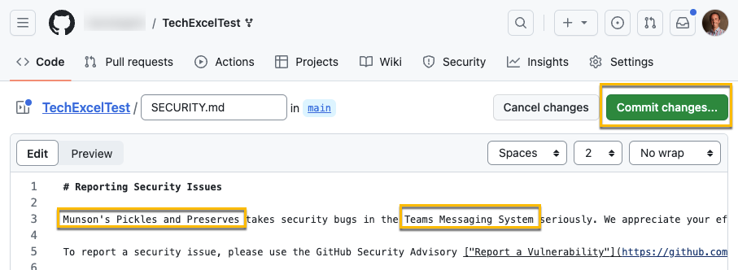

# Task 02 - Ensure your code is secure (20 minutes)

1. Select settings in your repo, then "Code security and analysis". Select "Enable" on "Dependabot alerts" and "Dependabot security updates".
    
    **Note** This will also automatically turn on Dependency graph
2. Navigate to for information about security policies. It also has a link to a sample security policy that should be used for this exercise - [https://github.com/electron/electron/blob/main/SECURITY.md](https://github.com/electron/electron/blob/main/SECURITY.md)
3. In your GitHub repot, select Security, Policy, and Start setup
   
4. Paste the security policy into the Markdown file (you can overwrite what is there now) and update it for the Munson's Pickles and Preserves Teams Messaging System and the GitHub repot your code is in, then commit the changes to the main branch.
   
5. Next we need to enable CodeQL. Select Settings and then Code security and analysis.
6. Scroll down if needed and select Set up in Code scanning for CodeQL analysis.
    
7. If you select "Default", the code scan will immediately be run. For this exercise, select Advanced.
    
8. By choosing the advanced option, you can see the YAML for the pipeline that actually performs the code check. We don't need to make any changes here, but it's something you should be familiar with. Any easy change to make in this file would be if you want to adjust the schedule of when the scan runs. After you're reviewed the YAML, Commit the change to main.
    
    
9. After you've committed the change, select Actions and you should see your CodeQL Scan workflow running.
    
10. After about 5 minutes, you should see the workflow has completed.
    
11. After it's complete, go back to "Settings" and "Code security and analysis". Then click the ellipsis (...) to "Set up". You'll see a couple of options there, "View last scan log, and "View Code Scanning alerts". Click and those just to explore. You shouldn't see much in either screen. The final option, "View CodeQL Workflow" will take you to the YAML file you created in step 9. **Note:** it will still say "Set up" since we chose the Advanced option instead of Basic.
    
